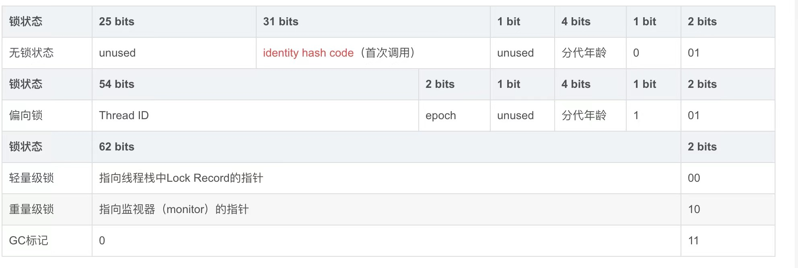

# JVM

单例模式，双重检测，指令重排序，https://tech.meituan.com/2014/09/23/java-memory-reordering.html

JIT codeCache 
https://tech.meituan.com/2020/10/22/java-jit-practice-in-meituan.html
内存模型
https://segmentfault.com/a/1190000023646225
为什么有两个 survivor
https://xuliugencn.blog.csdn.net/article/details/79606795

### 类的加载过程

加载->验证->准备->解析->初始化->卸载

**加载**

- 通过全类名获取定义此类的二进制字节流

- 将字节流所代表的静态存储结构转换为方法区的运行时数据结构

- 在内存中生成一个代表该类的 Class 对象,作为方法区这些数据的访问入口

**验证**

文件格式验证。元数据验证，字节码验证，符号引用验证

**准备**

准备阶段是正式为类变量分配内存并设置类变量初始化值的阶段，这些内存都将在方法区中分配。

- 这时候进行内存分配的仅包括类变量（static），而不包括实例变量，实例变量会在对象实例化时随着对象一块分配在 Java 堆中。

- 这里所设置的初始值"通常情况"下是数据类型默认的零值（如0、0L、null、false等），比如我们定义了`public static int value = 111` ，那么 value 变量在准备阶段的初始值就是 0 而不是111（初始化阶段才会赋值）。特殊情况：比如给 value 变量加上了 fianl 关键字`public static final int value = 111` ，那么准备阶段 value 的值就被赋值为 111。

**解析**

解析阶段是虚拟机将常量池内的符号引用替换为直接引用的过程。解析动作主要针对类或接口、字段、类方法、接口方法、方法类型、方法句柄和调用限定符7类符号引用进行。

符号引用就是一组符号来描述目标，可以是任何字面量。**直接引用**就是直接指向目标的指针、相对偏移量或一个间接定位到目标的句柄。在程序实际运行时，只有符号引用是不够的，举个例子：在程序执行方法时，系统需要明确知道这个方法所在的位置。Java 虚拟机为每个类都准备了一张方法表来存放类中所有的方法。当需要调用一个类的方法的时候，只要知道这个方法在方发表中的偏移量就可以直接调用该方法了。通过解析操作符号引用就可以直接转变为目标方法在类中方法表的位置，从而使得方法可以被调用。

综上，解析阶段是虚拟机将常量池内的符号引用替换为直接引用的过程，也就是得到类或者字段、方法在内存中的指针或者偏移量。

**初始化**

初始化是类加载的最后一步，也是真正执行类中定义的 Java 程序代码(字节码)，初始化阶段是执行初始化方法 `<clinit> ()`方法的过程。

对于`<clinit>（）` 方法的调用，虚拟机会自己确保其在多线程环境中的安全性。因为 `<clinit>（）` 方法是带锁线程安全，所以在多线程环境下进行类初始化的话可能会引起死锁，并且这种死锁很难被发现。

**卸载**

卸载类即该类的Class对象被GC。

卸载类需要满足3个要求:

- 该类的所有的实例对象都已被GC，也就是说堆不存在该类的实例对象。

- 该类没有在其他任何地方被引用

- 该类的类加载器的实例已被GC

### 类加载器

JVM 中内置了三个重要的 ClassLoader，除了 BootstrapClassLoader 其他类加载器均由 Java 实现且全部继承自`java.lang.ClassLoader`：

- **BootstrapClassLoader(启动类加载器)** ：最顶层的加载类，由C++实现，负责加载 `%JAVA_HOME%/lib`目录下的jar包和类或者或被 `-Xbootclasspath`参数指定的路径中的所有类。

- **ExtensionClassLoader(扩展类加载器)** ：主要负责加载目录 `%JRE_HOME%/lib/ext` 目录下的jar包和类，或被 `java.ext.dirs` 系统变量所指定的路径下的jar包。
- **AppClassLoader(应用程序类加载器)** :面向我们用户的加载器，负责加载当前应用classpath下的所有jar包和类。

### 双亲委派机制

每一个类都有一个对应它的类加载器。系统中的 ClassLoder 在协同工作的时候会默认使用 **双亲委派模型** 。即在类加载的时候，系统会首先判断当前类是否被加载过。已经被加载的类会直接返回，否则才会尝试加载。加载的时候，首先会把该请求委派该父类加载器的 `loadClass()` 处理，因此所有的请求最终都应该传送到顶层的启动类加载器 `BootstrapClassLoader` 中。当父类加载器无法处理时，才由自己来处理。当父类加载器为null时，会使用启动类加载器 `BootstrapClassLoader` 作为父类加载器。

**自定义加载器的话，需要继承 `ClassLoader` 。如果我们不想打破双亲委派模型，就重写 `ClassLoader` 类中的 `findClass()` 方法即可，无法被父类加载器加载的类最终会通过这个方法被加载。但是，如果想打破双亲委派模型则需要重写 `loadClass()` 方法**	


### 公司用的JVM版本

采集的信息
目前使用的是ConcurrentMarkSweep 老年代 ,ParNew 新生代 每 2 ~ 3 分钟触发一次 YoungGc, GC时长在19ms - 30 ms,
 • Par Eden Space
 • Code Cache
 • Compressed Class Space
 • Par Survivor Space
 • CMS Old Gens
 • Metaspace

### Java内存模型以及1.8的内存模型变化

Java内存模型规定了所有的变量都存储在主内存(Main Memory)中。每条线程 还有自己的工作内存(Working Memory ，线程的工作内存中保存了被该线程使用的变量的主内存副本[2]，线程对变量的所有操作(读取、赋值等)都必须在工作内存中进行，而不能直接读写主内存中的数据[3]。不同的线程之间也无法直接访问对方工作内存中的变 量，线程间变量值的传递均需要通过主内存来完成。

JDK1.8与1.7最大的区别是**1.8将永久代取消，取而代之的是元空间（MetaSpace）**。

### 运行时内存数据


### 垃圾回收算法

#### 怎么判断对象是垃圾？

通过可达性分析算法来判定对象是否存活。

#### GCRoots集合

- 虚拟机栈(栈帧中的本地变量表)中引用的对象

- 本地方法栈(Native 方法)中引用的对象

- 方法区中类静态属性引用的对象

- 方法区中常量引用的对象

#### 垃圾回收算法？

- 标记-清除算法

- 复制算法

- 标记整理算法

- 分代收集算法

#### 垃圾回收器？

- Serial收集器(Serial Old)

- ParNew收集器(Parallel Old)

- Parallel Scavenge收集器

- CMS收集器(老年代收集器)

- G1收集器(混合收集器)

- ZGC收集器

- **CMS（Concurrent Mark Sweep）收集器是一种以获取最短回收停顿时间为目标的收集器。它非常符合在注重用户体验的应用上使用。**

- **CMS（Concurrent Mark Sweep）收集器是 HotSpot 虚拟机第一款真正意义上的并发收集器，它第一次实现了让垃圾收集线程与用户线程（基本上）同时工作。**

从名字中的**Mark Sweep**这两个词可以看出，CMS 收集器是一种 **“标记-清除”算法**实现的，它的运作过程相比于前面几种垃圾收集器来说更加复杂一些。整个过程分为四个步骤：

- **初始标记：** 暂停所有的其他线程，并记录下直接与 root 相连的对象，速度很快 ；

- **并发标记：** 同时开启 GC 和用户线程，用一个闭包结构去记录可达对象。但在这个阶段结束，这个闭包结构并不能保证包含当前所有的可达对象。因为用户线程可能会不断的更新引用域，所以 GC 线程无法保证可达性分析的实时性。所以这个算法里会跟踪记录这些发生引用更新的地方。

- **重新标记：** 重新标记阶段就是为了修正并发标记期间因为用户程序继续运行而导致标记产生变动的那一部分对象的标记记录，这个阶段的停顿时间一般会比初始标记阶段的时间稍长，远远比并发标记阶段时间短

- **并发清除：** 开启用户线程，同时 GC 线程开始对未标记的区域做清扫。


从它的名字就可以看出它是一款优秀的垃圾收集器，主要优点：**并发收集、低停顿**。但是它有下面三个明显的缺点：

- **对 CPU 资源敏感；**

- **无法处理浮动垃圾；**

- **它使用的回收算法-“标记-清除”算法会导致收集结束时会有大量空间碎片产生。**

- ZGC垃圾回收器

#### 四种引用类型：强软弱虚

- 强引用是最传统的“引用”的定义，是指在程序代码之中普遍存在的引用赋值，即类似“Object obj=new Object()”这种引用关系。无论任何情况下，只要强引用关系还存在，垃圾收集器就永远不会回 收掉被引用的对象。

- 软引用是用来描述一些还有用，但非必须的对象。只被软引用关联着的对象，在系统将要发生内 存溢出异常前，会把这些对象列进回收范围之中进行第二次回收，如果这次回收还没有足够的内存， 才会抛出内存溢出异常。在JDK 1.2版之后提供了SoftReference类来实现软引用。

- 弱引用也是用来描述那些非必须对象，但是它的强度比软引用更弱一些，被弱引用关联的对象只 能生存到下一次垃圾收集发生为止。当垃圾收集器开始工作，无论当前内存是否足够，都会回收掉只 被弱引用关联的对象。在JDK 1.2版之后提供了WeakReference类来实现弱引用。多个引用时，其中一个为强引用，后面为虚引用，等到强引用失效时，就可以直接回收内存。参考ThreadLocal实现。

- 虚引用也称为“幽灵引用”或者“幻影引用”，它是最弱的一种引用关系。一个对象是否有虚引用的 存在，完全不会对其生存时间构成影响，也无法通过虚引用来取得一个对象实例。为一个对象设置虚 引用关联的唯一目的只是为了能在这个对象被收集器回收时收到一个系统通知。在JDK 1.2版之后提供 了PhantomReference类来实现虚引用。管理堆外内存DirectByteBuffer

#### 对象的访问

目前主流的访问方式有**①使用句柄**和**②直接指针**。

`句柄`: 如果使用句柄的话，那么Java堆中将会划分出一块内存来作为句柄池，reference 中存储的就是对象的句柄地址，而句柄中包含了对象实例数据与类型数据各自的具体地址信息。

`直接指针`： 如果使用直接指针访问，那么 Java 堆对象的布局中就必须考虑如何放置访问类型数据的相关信息，而 reference 中存储的直接就是对象的地址。

#### 内存占用的字节大小

在 Hotspot 虚拟机中，对象在内存中的布局可以分为 3 块区域：**对象头**、**实例数据**和**对齐填充**。

**Hotspot 虚拟机的对象头包括两部分信息**，**第一部分用于存储对象自身的运行时数据**（哈希码、GC 分代年龄、锁状态标志等等），**另一部分是类型指针**，即对象指向它的类元数据的指针，虚拟机通过这个指针来确定这个对象是那个类的实例。

**实例数据部分是对象真正存储的有效信息**，也是在程序中所定义的各种类型的字段内容。

**对齐填充部分不是必然存在的，也没有什么特别的含义，仅仅起占位作用。** 因为 Hotspot 虚拟机的自动内存管理系统要求对象起始地址必须是 8 字节的整数倍，换句话说就是对象的大小必须是 8 字节的整数倍。而对象头部分正好是 8 字节的倍数（1 倍或 2 倍），因此，当对象实例数据部分没有对齐时，就需要通过对齐填充来补全。

markword （hashcode(31位	), gc分代年龄(4 位)， 锁标志(3位)）8字节

class pointer 4字节

实例数据

对齐 追求效率 （4字节）



- 当一个对象已经计算过identity hash code，它就无法进入偏向锁状态； 

- 当一个对象当前正处于偏向锁状态，并且需要计算其identity hash code的话，则它的偏向锁会被撤销，并且锁会膨胀为轻量级锁或者重量锁； 

- 轻量级锁的实现中，会通过线程栈帧的锁记录存储Displaced Mark Word；重量锁的实现中，ObjectMonitor类里有字段可以记录非加锁状态下的mark word，其中可以存储identity hash code的值。

  #### 无锁
  
  
  
  #### 偏向锁
  
  对象头的变化，hashcode和偏向锁能不能共存？
  
   https://blog.csdn.net/Saintyyu/article/details/108295657
  
  #### 轻量级锁
  
  
  
  LockRecord是什么
  
  
  
  #### 重量级锁
  
  Monitor是什么
  
  锁：https://www.cnblogs.com/twoheads/p/10150063.html
  
  

#### 对象创建过程(半初始化)

##### Step1:类加载检查

虚拟机遇到一条 new 指令时，首先将去检查这个指令的参数是否能在常量池中定位到这个类的符号引用，并且检查这个符号引用代表的类是否已被加载过、解析和初始化过。如果没有，那必须先执行相应的类加载过程。

##### Step2:分配内存

在**类加载检查**通过后，接下来虚拟机将为新生对象**分配内存**。对象所需的内存大小在类加载完成后便可确定，为对象分配空间的任务等同于把一块确定大小的内存从 Java 堆中划分出来。**分配方式**有 **“指针碰撞”** 和 **“空闲列表”** 两种，**选择哪种分配方式由 Java 堆是否规整决定，而 Java 堆是否规整又由所采用的垃圾收集器是否带有压缩整理功能决定**。

**内存分配的两种方式：（补充内容，需要掌握）**

选择以上两种方式中的哪一种，取决于 Java 堆内存是否规整。而 Java 堆内存是否规整，取决于 GC 收集器的算法是"标记-清除"，还是"标记-整理"（也称作"标记-压缩"），值得注意的是，复制算法内存也是规整的

`内存分配并发问题（补充内容，需要掌握)`

在创建对象的时候有一个很重要的问题，就是线程安全，因为在实际开发过程中，创建对象是很频繁的事情，作为虚拟机来说，必须要保证线程是安全的，通常来讲，虚拟机采用两种方式来保证线程安全：

- **CAS+失败重试：** CAS 是乐观锁的一种实现方式。所谓乐观锁就是，每次不加锁而是假设没有冲突而去完成某项操作，如果因为冲突失败就重试，直到成功为止。**虚拟机采用 CAS 配上失败重试的方式保证更新操作的原子性。**

- **TLAB（Thread Local Allocation Buffer）：** 为每一个线程预先在 Eden 区分配一块儿内存，JVM 在给线程中的对象分配内存时，首先在 TLAB 分配，当对象大于 TLAB 中的剩余内存或 TLAB 的内存已用尽时，再采用上述的 CAS 进行内存分配。这一块区域不是线程共享的，也就是说，不一定堆就是共享的。

##### Step3:初始化零值

内存分配完成后，虚拟机需要将分配到的内存空间都初始化为零值（不包括对象头），这一步操作保证了对象的实例字段在 Java 代码中可以不赋初始值就直接使用，程序能访问到这些字段的数据类型所对应的零值。

##### Step4:设置对象头

初始化零值完成之后，**虚拟机要对对象进行必要的设置**，例如这个对象是哪个类的实例、如何才能找到类的元数据信息、对象的哈希码、对象的 GC 分代年龄等信息。 **这些信息存放在对象头中。** 另外，根据虚拟机当前运行状态的不同，如是否启用偏向锁等，对象头会有不同的设置方式。

##### Step5:执行 init 方法

在上面工作都完成之后，从虚拟机的视角来看，一个新的对象已经产生了，但从 Java 程序的视角来看，对象创建才刚开始，`<init>` 方法还没有执行，所有的字段都还为零。所以一般来说，执行 new 指令之后会接着执行 `<init>` 方法，把对象按照程序员的意愿进行初始化，这样一个真正可用的对象才算完全产生出来。

#### OOM问题处理

核心：拿到堆的快照

-XX:+HeapDumpOnOutOfMemoryError（启动时）

`补充例子`

```java
import java.util.HashMap;
import java.util.Map;

public class OOM {
    public static void main(String[] args) {
        Map map = new HashMap();

        for (int i = 0; i < 128; ++i) {
            map.put(i, new byte[1024 * 1024]);
        }
    }
}
```

`补充例子`

jamp -dump:live,format=b,file=<filepath> <pid>（运行时）

可能原因

代码问题、配置问题、内存真的不够

使用JProfiler找到Biggest Object，然后通过最大的对象，找到对应的GC roots path， 看看是谁引用了它。incoming references表示谁引用了它。


### 锁升级过程

- 锁的状态一共分为四种, 无锁、偏向锁、轻量级锁、重量级锁。
-  https://www.cnblogs.com/twoheads/p/10150063.html


### 排查JVM问题

- **`jps`**

​	jps (JVM Process Status Tool) 查看正在运行的java虚拟机进程，可以查看正在运行的java进程占用的pid

- **`jstat`**

​	jstat(JVM Statistics Mornitoring Tool): 查看虚拟机运行时信息，jstat可以查看Java虚拟机各种运行状态信息，可以通过它查看JAVA虚拟机进程中的类装载、堆内存、垃圾收集、JIT编译等运行数据。

jstat -gc <pid>

- **`jmap`**

​	jmap可以生成Java程序的堆的dump文件，也可以查看堆内存对象的统计信息，查看ClassLoader的信息以及finalizer队列

​	-histo：显示堆中对象统计信息，包括类、实例数量和合计容量

​	-dump：生成Java堆快照。格式为：-dump:[live,]format=b,file=<filename>，其中live子参数说明是否只dump出存活的对象

​	`jmap -dump:format=b,file=/root/logs/heap.hprof 1612<pid>`

- **`jhat`**

​	jhat(JVM Heap Analysis Tool ) : JDK自带的堆分析工具

​	jhat命令与jmap命令搭配使用，用来分析jmap生成的堆快照信息

- **`jstack`**

jstack(Stack Trace For Java): 查看虚拟机当前时刻的线程快照

线程快照就是当前虚拟机内每一个线程正在执行的方法堆栈的集合，生成线程快照的主要目的是定位线程出现长时间停顿的原因，如线程间死锁、死循环、请求外部资源导致的长时间等待等都是导致线程长时间停顿的原因。

`jstack -l 1612 > /root/logs/jstack.txt`

- **`jinfo`**

jinfo(Configuration Info For Java) : 实时查看和调整虚拟机的各项参数

-flags 打印VM参数

-sysprops：打印Java相关系统参数

- **`visualvm`** 

图形化界面，一般在测试环境使用

##### 其他工具

- Apache 压力测试工具 JMeter

- JProfiers

- Arthas